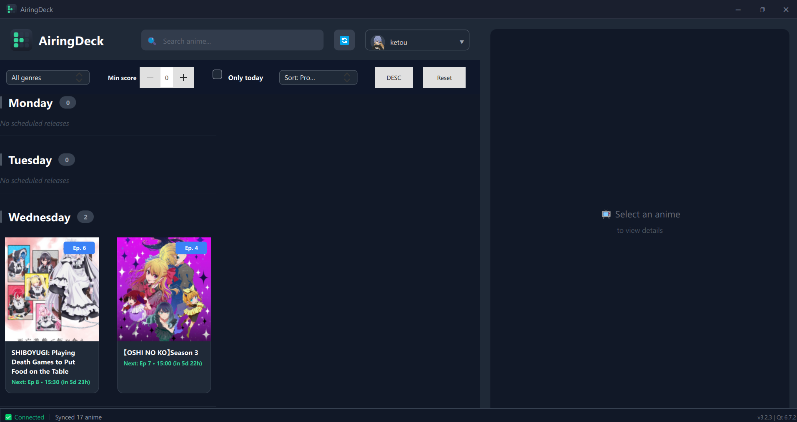

# AiringDeck

Desktop app nativa per tracciare le uscite anime con integrazione AniList.

## 🚀 Features

- ✅ Qt 6.7 native application
- ✅ AniList OAuth authentication
- ✅ Calendar view of airing episodes
- ✅ Episode tracking and notifications
- ✅ Modern QML UI
- ✅ Low memory footprint (~50MB)
- ✅ Windows native .exe

## 🖼️ UI Screenshots

### Calendar View


### Details Panel


## 🛠️ Tech Stack

- **UI Framework**: Qt 6.7 (PySide6)
- **UI Language**: QML (declarative)
- **Backend**: Python 3.11+
- **Native Acceleration**: CPython C extension (`core._airingdeck_native`)
- **API**: AniList GraphQL
- **Packaging**: PyInstaller
- **Secure Storage**: keyring

## 📦 Development Setup

### Prerequisites
- Python 3.11 or higher
- pip

### Installation

```bash
# Create virtual environment
python -m venv venv

# Activate virtual environment
# Windows
.\venv\Scripts\activate

# Install dependencies
pip install -r requirements.txt
```

### Run Development

```bash
python src/main.py
```

### Update Notifications

L'app controlla automaticamente gli aggiornamenti all'avvio.
Se trova una versione piu recente, mostra un avviso con:

- cosa cambia per l'utente (note release),
- pulsante `Aggiorna ora` (apre la pagina release),
- freccia per chiudere l'avviso.

Configurazione opzionale via variabili ambiente:

```bash
AIRINGDECK_UPDATE_REPOSITORY=Pankyop/AiringDeck
AIRINGDECK_UPDATE_FEED_URL=https://api.github.com/repos/Pankyop/AiringDeck/releases/latest
AIRINGDECK_UPDATE_TAGS_URL=https://api.github.com/repos/Pankyop/AiringDeck/tags
AIRINGDECK_UPDATE_DOWNLOAD_URL=https://github.com/Pankyop/AiringDeck/releases
```

### Build .exe

```bash
python scripts/build_windows.py
```

Output: `dist/AiringDeck.exe`

Build ottimizzato per CPU recenti (default `avx2`, adatto a Intel 10th gen+ e AMD Zen2+/serie 4000+):

```bash
python scripts/build_windows.py --cpu-profile avx2
```

Profilo AVX-512 opzionale (solo su macchine che supportano AVX-512):

```bash
python scripts/build_windows.py --cpu-profile avx512
```

Nota: il build prova a compilare automaticamente anche l'estensione nativa C (`setup.py build_ext --inplace`) prima di creare l'exe.
Se il compilatore C/C++ non è presente, continua con fallback Python.
Per rendere obbligatoria la compilazione nativa:

```bash
python scripts/build_windows.py --cpu-profile avx2 --require-native
```

## ⚡ Native Optimization

- Il filtro testuale della lista anime usa un modulo C (`src/core/_airingdeck_native.c`) per ridurre overhead nei loop Python.
- Se il modulo nativo non è disponibile, l'app usa fallback automatico in puro Python (`src/core/native_accel.py`).
- L'integrazione è trasparente: nessun cambiamento lato QML/UI.

## 📁 Project Structure

```
airingdeck/
├── src/
│   ├── main.py                 # Entry point
│   ├── core/
│   │   ├── app_controller.py   # Main controller
│   │   ├── anime_model.py      # Qt list model
│   │   └── worker.py           # Async worker wrapper
│   ├── services/
│   │   ├── anilist_service.py  # AniList API
│   │   └── auth_service.py     # OAuth
│   └── ui/
│       └── qml/                # QML UI files
│           ├── BootShell.qml
│           └── components/
├── resources/
│   ├── icons/
│   ├── images/
│   └── fonts/
├── scripts/
│   └── build_windows.py        # Build script
├── requirements.txt
└── README.md
```

## 🎨 UI Architecture

- **QML**: Declarative UI (similar to React)
- **Python Backend**: Business logic & API calls
- **Qt Signals/Slots**: Communication between QML ↔ Python
- **Property Bindings**: Reactive data binding

## 📝 License

MIT
